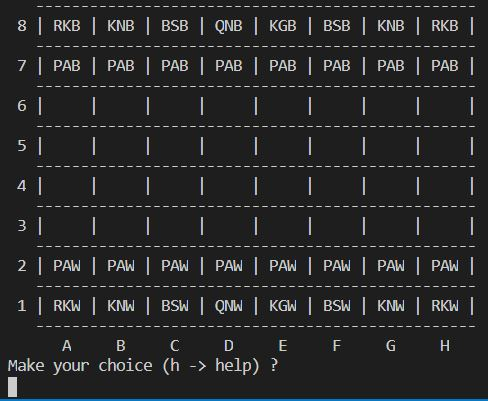

# Chess Movements Validator

### Abstract

Chess movement engine validator using .Net Core.

### Examples

```c#
// create a new board for play and move a Pawn
var board = Board.NewGame();
var result = board.MovePiece( 'A', 2, 'A', 4 );

// create a empty board, set a Pawn and move it
var board = Board.NewEmpty();
board.SetWhite<Pawn>( 'A', 5 );
var result = board.MovePiece( 'A', 2, 'A', 4 );

// create a new game and try to move a wrong color piece
var game = new ChessGame();
var result = game.MovePiece( 'F', 7, 'F', 8 );

> The piece selected has wrong color.
> The next player is WHITE
```

### Useful information

Chess.Core is a .Net Standard Library which contains the chess domain model (ie. Piece, Board, Game .....).

Chess.Player is a simple .Net console useful for simulating a chess game directly from text console.



### Building and running instructions

* git clone https://github.com/antdimot/chess-movement-validator.git
* cd chess-movement-validator
* dotnet restore
* dotnet build
